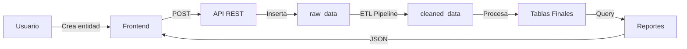

# 💰 Sistema de Contabilidad Web

Sistema web integral de contabilidad empresarial con gestión completa de facturas, pagos, clientes, proveedores, productos y reportes financieros en tiempo real.

## 📋 Tabla de Contenidos

- [Descripción General](#descripción-general)
- [Características Principales](#características-principales)
- [Arquitectura del Sistema](#arquitectura-del-sistema)
- [Tecnologías Utilizadas](#tecnologías-utilizadas)
- [Instalación](#instalación)
- [API REST](#api-rest)
- [Base de Datos](#base-de-datos)
- [Pipeline ETL](#pipeline-etl)
- [Estructura del Proyecto](#estructura-del-proyecto)
- [Diagramas](#diagramas)

## 📝 Descripción General

Sistema de contabilidad web desarrollado para la gestión financiera integral de pequeñas y medianas empresas. Permite el control completo de:

- **Ingresos**: Facturas de venta, pagos recibidos
- **Gastos**: Facturas de compra, órdenes de compra, pagos a proveedores
- **Maestros**: Clientes, proveedores, productos
- **Reportes**: Balance general, cuentas por cobrar/pagar, análisis financiero
- **ETL Pipeline**: Procesamiento y validación automática de datos

### Características Distintivas

- ✅ **Sistema ETL integrado**: Todos los datos pasan por validación antes de ser procesados
- ✅ **Arquitectura REST**: API completa con documentación automática
- ✅ **Interfaz moderna**: SPA (Single Page Application) responsive
- ✅ **Backups automáticos**: Respaldo en CSV de todos los datos procesados
- ✅ **Gestión de proveedores**: Sistema completo con información de contacto
- ✅ **Items de facturas**: Gestión detallada de productos en facturas

## 🏗️ Arquitectura del Sistema

```
┌─────────────────────────────────────────────────────────────┐
│                     FRONTEND (SPA)                          │
│  HTML5 + CSS3 + JavaScript Vanilla                          │
│  - Interfaz responsive                                      │
│  - Comunicación asíncrona via Fetch API                     │
│  - Manejo de estado en cliente                              │
└────────────────────┬────────────────────────────────────────┘
                     │ HTTP/REST
┌────────────────────▼────────────────────────────────────────┐
│                     API REST (FastAPI)                      │
│  - Endpoints RESTful                                        │
│  - Validación con Pydantic                                  │
│  - Documentación automática (OpenAPI)                       │
│  - CORS habilitado                                          │
└────────────────────┬────────────────────────────────────────┘
                     │
┌────────────────────▼────────────────────────────────────────┐
│                  CAPA DE NEGOCIO                            │
│  - CRUD Operations                                          │
│  - ETL Pipeline                                             │
│  - Validación de datos                                      │
│  - Generación de reportes                                   │
└────────────────────┬────────────────────────────────────────┘
                     │
┌────────────────────▼────────────────────────────────────────┐
│                  ORM (SQLAlchemy)                           │
│  - Modelos de datos                                         │
│  - Relaciones y constraints                                 │
│  - Migraciones                                              │
└────────────────────┬────────────────────────────────────────┘
                     │
┌────────────────────▼────────────────────────────────────────┐
│                  MySQL Database                             │
│  - Tablas normalizadas                                      │
│  - Integridad referencial                                   │
│  - Índices optimizados                                      │
└─────────────────────────────────────────────────────────────┘
```

## 💻 Tecnologías Utilizadas

### Frontend
- **HTML5**: Estructura semántica
- **CSS3**: Diseño responsive con Flexbox y Grid
- **JavaScript ES6+**: Lógica de aplicación (Vanilla JS, sin frameworks)
- **Fetch API**: Comunicación asíncrona con el backend
- **DOM API**: Manipulación dinámica de interfaz

### Backend
- **Python 3.9+**: Lenguaje principal
- **FastAPI**: Framework web moderno y rápido
- **SQLAlchemy 2.0**: ORM para mapeo objeto-relacional
- **Pydantic**: Validación de datos y serialización
- **PyMySQL**: Driver MySQL para Python
- **Uvicorn**: Servidor ASGI de alto rendimiento

### Base de Datos
- **MySQL 8.0+**: Sistema de gestión de base de datos
- **InnoDB**: Motor de almacenamiento transaccional
- **UTF8MB4**: Soporte completo de caracteres Unicode

### DevOps & Herramientas
- **Git**: Control de versiones
- **CSV**: Formato de respaldo de datos
- **JSON**: Intercambio de datos y metadata
- **CORS**: Cross-Origin Resource Sharing configurado

## 🚀 Instalación

### Requisitos Previos

- Python 3.9 o superior
- MySQL 8.0 o superior
- pip (gestor de paquetes de Python)
- Navegador web moderno (Chrome, Firefox, Safari, Edge)

### Pasos de Instalación

#### 1. Clonar el repositorio
```bash
git clone <url-del-repositorio>
cd contabilidad
```

#### 2. Crear entorno virtual Python
```bash
# macOS/Linux
python3 -m venv venv
source venv/bin/activate

# Windows
python -m venv venv
venv\Scripts\activate
```

#### 3. Instalar dependencias
```bash
pip install -r requirements.txt
```

#### 4. Configurar MySQL
```bash
# Crear base de datos
mysql -u root -pContaEntregable04 -e "CREATE DATABASE IF NOT EXISTS contabilidad CHARACTER SET utf8mb4 COLLATE utf8mb4_unicode_ci;"

# Crear tablas
mysql -u root -pContrasena contabilidad < create_tables.sql

# Cargar datos de ejemplo (opcional)
mysql -u root -pContaEntregable04 contabilidad < clean_and_dummy_data.sql
```

#### 5. Iniciar el servidor
```bash
uvicorn main:app --reload --host 0.0.0.0 --port 8000
```

#### 6. Acceder a la aplicación
- **Frontend**: Abrir `frontend/index.html` en el navegador
- **API Docs**: http://localhost:8000/docs
- **API Redoc**: http://localhost:8000/redoc

## 🔌 API REST

### Endpoints Principales

#### Ingresos
- `GET /api/facturas/venta/` - Listar facturas de venta
- `POST /api/facturas/venta/` - Crear factura de venta
- `GET /api/facturas/venta/{id}/` - Obtener factura específica
- `PUT /api/facturas/venta/{id}/` - Actualizar factura
- `DELETE /api/facturas/venta/{id}/` - Eliminar factura

#### Gastos
- `GET /api/facturas/compra/` - Listar facturas de compra
- `POST /api/facturas/compra/` - Crear factura de compra
- `GET /api/ordenes/compra/` - Listar órdenes de compra
- `POST /api/ordenes/compra/` - Crear orden de compra

#### Pagos
- `GET /api/pagos/recibidos/` - Listar pagos recibidos
- `POST /api/pagos/recibidos/` - Registrar pago recibido
- `GET /api/pagos/proveedor/` - Listar pagos a proveedores
- `POST /api/pagos/proveedor/` - Registrar pago a proveedor

#### Maestros
- `GET /api/clientes/` - Listar clientes
- `POST /api/clientes/` - Crear cliente
- `GET /api/proveedores/` - Listar proveedores
- `POST /api/proveedores/` - Crear proveedor
- `GET /api/productos/` - Listar productos
- `POST /api/productos/` - Crear producto

#### Items de Facturas
- `GET /api/factura-items/` - Listar items de facturas
- `POST /api/factura-items/` - Agregar item a factura

#### Reportes
- `GET /api/reportes/resumen/` - Resumen financiero general
- `GET /api/reportes/facturas-pendientes/` - Facturas con pagos pendientes

#### ETL Pipeline
- `POST /api/pipeline/run` - Ejecutar pipeline ETL manualmente
- `GET /api/cleaned/` - Ver datos procesados por ETL

### Formato de Respuesta

Todas las respuestas siguen el formato JSON:

```json
// Éxito
{
  "status": "success",
  "data": {...},
  "message": "Operación exitosa"
}

// Error
{
  "detail": "Descripción del error"
}
```

## 🗄️ Base de Datos

### Esquema de Tablas

#### Tablas Principales

```sql
-- Tabla de datos crudos (ETL)
raw_data
├── id (PK)
├── tipo
├── descripcion
├── monto
├── fecha
├── metadata_json
└── creado_en

-- Tabla de datos limpios (ETL)
cleaned_data
├── id (PK)
├── tipo
├── descripcion
├── monto
├── fecha
├── validado_por
└── tabla_destino

-- Facturas de Venta
facturas_venta
├── id (PK)
├── cliente
├── descripcion
├── monto
├── fecha
├── raw_id (FK)
└── creado_en

-- Facturas de Compra
facturas_compra
├── id (PK)
├── proveedor
├── descripcion
├── monto
├── fecha
├── raw_id (FK)
└── creado_en

-- Clientes
clientes
├── id (PK)
├── nombre
├── identificacion (UNIQUE)
├── correo
├── telefono
├── direccion
└── creado_en

-- Proveedores
proveedores
├── id (PK)
├── nombre
├── identificacion (UNIQUE)
├── correo
├── telefono
├── direccion
├── contacto_nombre
├── contacto_telefono
└── creado_en

-- Productos
productos
├── id (PK)
├── nombre
├── sku (UNIQUE)
├── precio_unitario
├── descripcion
└── creado_en

-- Items de Facturas
factura_items
├── id (PK)
├── factura_tipo (ENUM: venta/compra)
├── factura_venta_id (FK)
├── factura_compra_id (FK)
├── producto_id (FK)
├── cantidad
├── precio
└── subtotal (COMPUTED)
```

### Relaciones

```
facturas_venta ←──── pagos_recibidos
      ↑
      │
factura_items ───→ productos
      │
      ↓
facturas_compra ←──── pagos_proveedor
                      │
ordenes_compra ←──────┘
```

## 🔄 Pipeline ETL

### Flujo de Procesamiento

```
┌──────────────┐     ┌──────────────┐     ┌──────────────┐
│   EXTRACT    │────▶│  TRANSFORM   │────▶│     LOAD     │
│              │     │              │     │              │
│  raw_data    │     │  Validación  │     │ Tablas       │
│  table       │     │  Limpieza    │     │ finales      │
│              │     │  Formateo    │     │              │
└──────────────┘     └──────────────┘     └──────────────┘
        │                    │                    │
        ▼                    ▼                    ▼
   CSV Backup         cleaned_data          Registros
                         table               finales
```

### Características del Pipeline

1. **Extracción**: Lee todos los registros de `raw_data`
2. **Transformación**: 
   - Valida tipos de datos
   - Limpia strings
   - Verifica integridad
   - Procesa metadata JSON
3. **Carga**: 
   - Inserta en tablas destino
   - Evita duplicados
   - Mantiene trazabilidad
4. **Respaldo**: 
   - Genera CSV de raw_data
   - Genera CSV de cleaned_data
   - Logs JSON con timestamp

### Ejecución del Pipeline

```bash
# Método 1: Desde el frontend
Click en "Ejecutar limpieza manual"

# Método 2: API REST
curl -X POST http://localhost:8000/api/pipeline/run

# Método 3: Línea de comandos
python etl_pipeline.py
```

## 📁 Estructura del Proyecto

```
contabilidad/
│
├── 📁 frontend/                 # Interfaz de usuario
│   ├── 📄 index.html           # Página principal
│   ├── 🎨 style.css            # Estilos CSS
│   ├── 📜 main.js              # Lógica JavaScript
│   └── 🎨 favicon.svg          # Icono de la aplicación
│
├── 📁 backups/                  # Respaldos automáticos
│   ├── raw_*.csv               # Backups de datos crudos
│   └── cleaned_*.csv           # Backups de datos limpios
│
├── 📁 logs/                     # Logs del sistema
│   └── log_*.json              # Logs de ejecución ETL
│
├── 🐍 main.py                   # API principal (FastAPI)
├── 🐍 models.py                 # Modelos SQLAlchemy
├── 🐍 database.py               # Configuración de BD
├── 🐍 crud.py                   # Operaciones CRUD
├── 🐍 etl_pipeline.py          # Pipeline ETL
├── 🐍 scheduler.py             # Tareas programadas
│
├── 📄 create_tables.sql         # Script creación de tablas
├── 📄 clean_and_dummy_data.sql  # Datos de ejemplo
├── 📄 requirements.txt          # Dependencias Python
├── 📄 .gitignore               # Archivos ignorados
└── 📄 README.md                # Este archivo
```

## 📊 Diagramas

### Flujo de Datos



### Diagrama ER Simplificado

```
┌─────────────┐      ┌─────────────┐      ┌─────────────┐
│  CLIENTES   │      │  PRODUCTOS  │      │ PROVEEDORES │
└──────┬──────┘      └──────┬──────┘      └──────┬──────┘
       │                    │                     │
       │              ┌─────▼─────┐              │
       └─────────────▶│   ITEMS   │◀─────────────┘
                      │  FACTURA  │
                      └─────┬─────┘
                            │
                ┌───────────┴───────────┐
                │                       │
         ┌──────▼──────┐       ┌───────▼──────┐
         │  FACTURAS   │       │   FACTURAS   │
         │    VENTA    │       │    COMPRA    │
         └──────┬──────┘       └───────┬──────┘
                │                       │
         ┌──────▼──────┐       ┌───────▼──────┐
         │    PAGOS    │       │    PAGOS     │
         │  RECIBIDOS  │       │  PROVEEDOR   │
         └─────────────┘       └──────────────┘
```

## 🔒 Seguridad

- ✅ Validación de entrada con Pydantic
- ✅ Prevención de inyección SQL (ORM)
- ✅ Sanitización de datos
- ✅ CORS configurado
- ✅ Manejo seguro de errores
- ✅ Logs de auditoría

## 🛠️ Mantenimiento

### Respaldos
- Automáticos en cada ejecución ETL
- Formato CSV para portabilidad
- Nomenclatura con timestamp

### Logs
- Formato JSON estructurado
- Timestamp en cada operación
- Trazabilidad completa

## 📈 Características Futuras

- [ ] Autenticación y autorización
- [ ] Dashboard con gráficos
- [ ] Exportación a Excel/PDF
- [ ] API GraphQL
- [ ] Notificaciones en tiempo real
- [ ] Multi-moneda
- [ ] Multi-empresa
- [ ] Integración con bancos

## 🤝 Contribución

Este proyecto fue desarrollado como entregable académico. Para contribuciones:

1. Fork el proyecto
2. Crea tu feature branch (`git checkout -b feature/AmazingFeature`)
3. Commit tus cambios (`git commit -m 'Add some AmazingFeature'`)
4. Push al branch (`git push origin feature/AmazingFeature`)
5. Abre un Pull Request

## 📝 Licencia

Proyecto académico - Universidad [Nombre Universidad]
Desarrollado por: [Tu nombre]
Año: 2024

## 📞 Soporte

Para reportar problemas o solicitar ayuda:
- Crear un issue en GitHub
- Contactar al desarrollador

---

**Última actualización**: Diciembre 2024
**Versión**: 1.0.0
